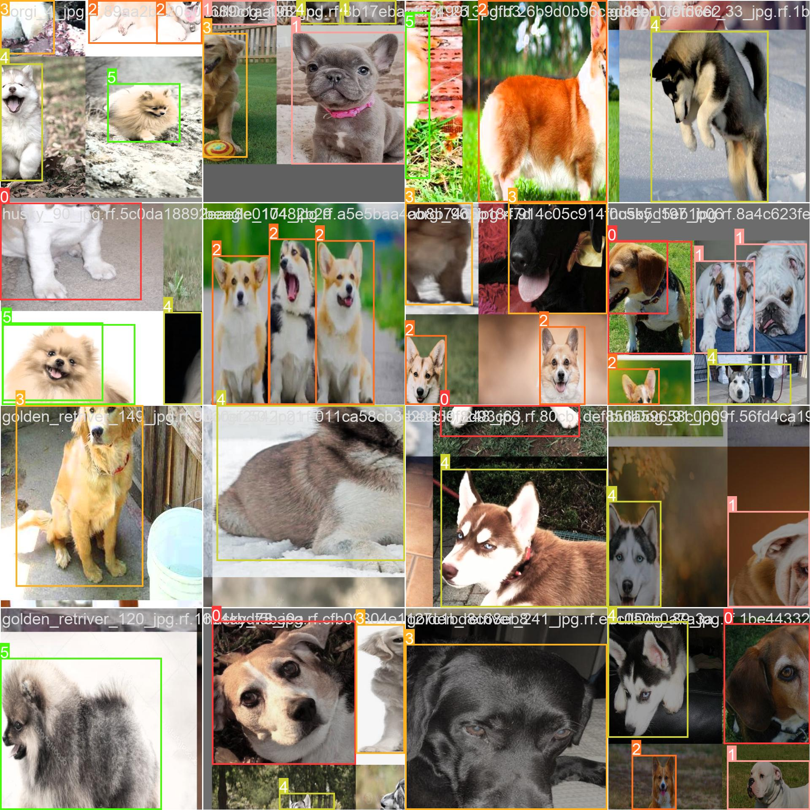

# Dog Breed Identification with YOLO

This project aims to identify dog breeds using the YOLO (You Only Look Once) object detection framework. The model is trained to recognize various dog breeds and can detect and classify them in images or videos.

## Project Overview

- **Objective**: To build a machine learning model that accurately identifies dog breeds in images and videos using YOLOv5.
- **Dataset**: The model is trained on a dataset of images containing different dog breeds (Beagle, bullDog, corgi, goldenRetriever, husky, pomeranian), with annotations prepared in the YOLO format.
- **Model**: YOLOv5, a state-of-the-art real-time object detection model, is used for this project.
- **Training**: The model is fine-tuned on a custom dataset of dog breeds, optimizing for accuracy in breed classification.
- **Detection**: The trained model is capable of detecting and classifying dog breeds in new images or videos.

## Key Features

- **Real-Time Detection**: The model can detect and classify dog breeds in real-time using a webcam.
- **Versatility**: Capable of identifying multiple dog breeds within a single image or video frame.
- **Customizable**: The model can be retrained with additional data to include more dog breeds or improve accuracy.

## Setup and Installation

1. **Clone the Repository**:
   ```bash
   git clone https://github.com/adryanhy/Projeto-Machine-Learning.git
   cd Projeto-Machine-Learning
   ```

2. **Install Dependencies**:
   ```bash
   pip install -r requirements.txt
   ```

3. **Download YOLOv5 and Pre-Trained Weights**:
   ```bash
   git clone https://github.com/ultralytics/yolov5.git
   cd yolov5
   pip install -r requirements.txt
   ```

4. **Training the Model** (Optional):
   - Prepare your dataset and configure `dog_breeds.yaml` with your data paths and classes.
   - Run the training script:
     ```bash
     python train.py --img 640 --batch 16 --epochs 100 --data dog_breeds.yaml --weights yolov5s.pt
     ```

5. **Detect Dog Breeds**:
   - To detect dog breeds in an image or video:
     ```bash
     python detect.py --weights runs/train/exp/weights/best.pt --source path_to_image_or_video
     ```
   - To use your webcam for real-time detection:
     ```bash
     python detect.py --weights runs/train/exp/weights/best.pt --source 0
     ```

## Results

The model outputs the detected dog breeds along with confidence scores, both visually in the form of bounding boxes around the dogs and as text.


